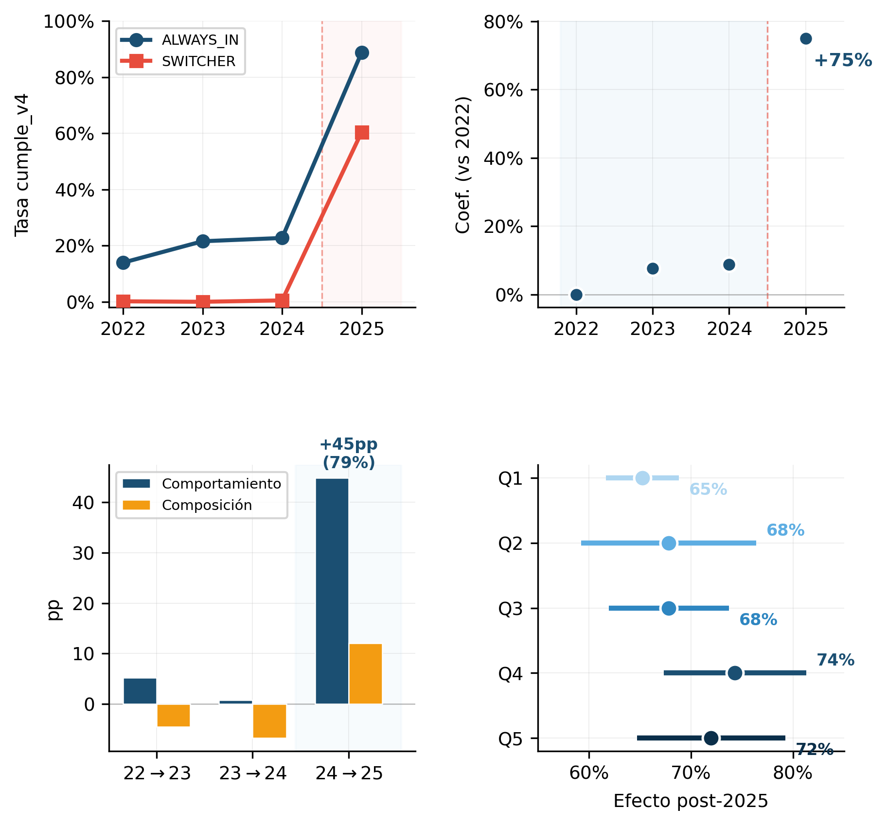

# Análisis Causal del Indicador de Transmisión SIGA-MEF

**Evaluación de impacto de la transición SIGA Escritorio → SIGA Web en el cumplimiento del registro del Cuadro Multianual de Necesidades (CMN)**

[](https://www.python.org/)
[](https://www.postgresql.org/)
[](LICENSE)

---

## Resumen Ejecutivo

Este repositorio contiene el análisis causal que explica por qué el indicador de transmisión SIGA-MEF del Plan de Acción de Reforma del Sistema Nacional de Abastecimiento (PAR-SNA) **saltó de 34% a 74%** en un solo año (2024→2025).

### Hallazgo Principal

> **El 79% del salto se explica porque las mismas entidades que ya tenían SIGA mejoraron su cumplimiento**, no porque entraron entidades nuevas al padrón. El efecto es generalizado: entidades pequeñas y grandes saltan por igual (todas > 65 pp).

La evidencia apunta a que la **transición de SIGA Escritorio a SIGA Web** simplificó el proceso de registro del CMN.

---

## Estructura del Repositorio

```
dga2025/
├── README.md
├── informe/
│   ├── informe_causal_v4.pdf      # Informe técnico completo
│   ├── informe_causal_v4.tex      # Fuente LaTeX
│   └── anexo_normativo.tex
│
├── scraping/                       # Web scraping Consulta Amigable MEF
│   ├── run_scrape.py              # Ejecución secuencial
│   ├── run_parallel.py            # Ejecución paralela
│   ├── scraper.py                 # Lógica Selenium
│   ├── routes.py                  # Configuración rutas/niveles
│   ├── padron.py                  # Filtrado por padrón SIGA
│   └── config.py
│
├── analisis/                       # Scripts de análisis causal
│   ├── event_study_cumple_v4/     # Event Study (TWFE)
│   ├── oaxaca_blinder/            # Descomposición Oaxaca-Blinder
│   ├── heterogeneidad_pia/        # Heterogeneidad por tamaño presup.
│   ├── did_clasico_2x2/           # DiD clásico 2x2
│   ├── did_psm/                   # DiD con Propensity Score Matching
│   ├── placebo_tests/             # Tests de validación
│   └── diagnostics_extras/
│
├── etl/                            # Pipeline ETL
│   ├── load_parquet_to_postgres.py
│   ├── build_ind1_model.py
│   └── init/                      # SQL de inicialización (raw→dwh→mart)
│
├── figuras/                        # Visualizaciones finales
│   ├── dashboard_resumen_latex.png
│   ├── fig1_coeff_partA_latex.png
│   └── ...
│
└── datos/
    └── README.md                  # Descripción de fuentes de datos
```

---

## Metodología

### Desafíos Técnicos Abordados

| Desafío | Solución |
|---------|----------|
| Normativa densa y dispersa (6 instrumentos legales) | Búsqueda estructurada en PostgreSQL |
| Datos voluminosos e inconsistentes (SIGA MEF, SIGA MINEDU, padrones DPIP) | Modelo relacional PostgreSQL (esquemas `raw`→`dwh`→`mart`) |
| Sin datos presupuestales consolidados para +2,800 UEs | Web scraping del portal Consulta Amigable MEF |
| Sin grupo de control puro ni variable para RD | Triangulación: Event Study, DiD+PSM, Oaxaca-Blinder |

### Métodos de Inferencia Causal

1. **Event Study (TWFE)** - Identificación del efecto tratamiento con leads/lags
2. **Diferencias en Diferencias con PSM** - Control por características observables
3. **Descomposición Oaxaca-Blinder** - Separación efecto composición vs. comportamiento
4. **Análisis de Heterogeneidad** - Efectos por quintil de presupuesto (PIA)
5. **Tests de Placebo** - Validación de supuestos (tendencias paralelas pre-tratamiento)

---

## Resultados Clave

### Coeficientes Event Study



### Tests de Placebo

| Test | δ (pp) | SE | p-value | Interpretación |
|------|--------|-----|---------|----------------|
| Placebo 2022→2023 | -0.8 | 1.2 | 0.51 | No hay efecto falso |
| Placebo 2023→2024 | +1.1 | 1.4 | 0.43 | Tendencias paralelas OK |
| **Real 2024→2025** | **+40.2** | 2.1 | <0.001 | **Efecto significativo** |

---

## Stack Tecnológico

- **Lenguaje**: Python 3.10+
- **Base de datos**: PostgreSQL 15
- **Web scraping**: Selenium + ChromeDriver
- **Análisis estadístico**: statsmodels, linearmodels
- **Visualización**: matplotlib, seaborn
- **ETL**: pandas, pyarrow (Parquet)

---

## Instalación

```bash
# Clonar repositorio
git clone https://github.com/JSalvadorA/dga2025.git
cd dga2025

# Crear entorno virtual
python -m venv .venv
source .venv/bin/activate  # Linux/Mac
# .venv\Scripts\activate   # Windows

# Instalar dependencias
pip install -r requirements.txt

# Configurar PostgreSQL (ver etl/init/)
psql -f etl/init/00_bootstrap.sql
```

---

## Uso

### 1. Scraping de datos presupuestales

```bash
cd scraping
python run_parallel.py --years 2022 2023 2024 2025 --workers 4
```

### 2. Cargar datos a PostgreSQL

```bash
cd etl
python load_parquet_to_postgres.py
python build_ind1_model.py
```

### 3. Ejecutar análisis causal

```bash
cd analisis/event_study_cumple_v4
python run_event_study_cumple_v4.py
python plot_event_study.py
```

---

## Contexto Institucional

Este análisis se desarrolló como complemento a actividades en la **Dirección General de Abastecimiento del MEF** (Perú), en el marco del seguimiento al Plan de Acción de Reforma del Sistema Nacional de Abastecimiento (PAR-SNA).

### Marco Normativo

- **Decreto Legislativo 1439** - Ley del Sistema Nacional de Abastecimiento
- **Decreto Supremo 217-2019-EF** - Reglamento del SNA
- **Directiva 0007-2022-EF/54.01** - Lineamientos para el CMN

---

## Documentación

- [Informe Técnico Completo (PDF)](informe/informe_causal_v4.pdf)
- [Descripción de Fuentes de Datos](datos/README.md)

---

## Autor

**Jerson Salvador**
Data Engineer · Econometría Aplicada · Políticas Públicas

[](https://www.linkedin.com/in/jerson-salvador-agurto-a903b427b/)

---

## Licencia

Este proyecto está bajo la Licencia MIT. Ver [LICENSE](LICENSE) para más detalles.

---

## Citación

```bibtex
@misc{salvador2025siga,
  author = {Salvador, Jerson},
  title = {Análisis Causal del Indicador de Transmisión SIGA-MEF},
  year = {2025},
  publisher = {GitHub},
  url = {https://github.com/JSalvadorA/dga2025}
}
```
